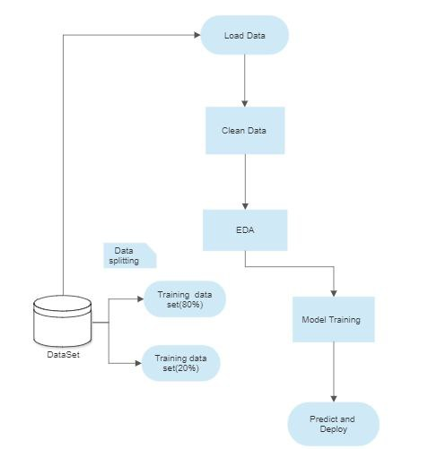

# A-B_Test_SmartAd_user_analysis

## Our Pipe line design is this



**Table of content**

- [Smart Ad user analytics](#A-B_Test_SmartAd_user_analysis)
  - [Overview](#overview)
  - [Requirements](#requirements)
  - [Install](#install)
  - [Data](#data)
  - [Features](#features)
    - [Data Processing and Analysis](#data-processing-and-analysis)
    - [Scripts](#scripts)
    - [Test](#test)

## Overview

The repo is all about A/B testing by using two groups the exposed and control group. The exposed group were given the smart ad about brand LUX where as the control groups were given some dummy ad about the brand LUX. Classical and Statistical A/B testing has been used to test. After all the tests our aim is to increase the efficiency of our BIO (Brand Impact Optimization) 

## Requirements
  Python 3.7 and above

## Install
```
git clone https://github.com/Micky373/A-B_test_SmartAd_user_analysis
cd SmartAd_service_analysis
pip install -r requirements.txt
```

## Data
  The BIO data for this project is a “Yes” and “No” response of online users to the following question


    Q: Do you know the brand Lux?
		O  Yes
		O  No

SmartAd ran this campaign from 3-10 July 2020. The users that were presented with the questionnaire above were chosen according to the following rule:

`Control:` users who have been shown a dummy ad
`Exposed:` users who have been shown a creative (ad) that was designed by SmartAd for the client.

## Features

### Data Processing and Analysis
  - 
### Scripts
 - All the scripts used by the notebooks are inside the scripts folder.

### Test
 - Tests for the scripts are inside the tests folder.